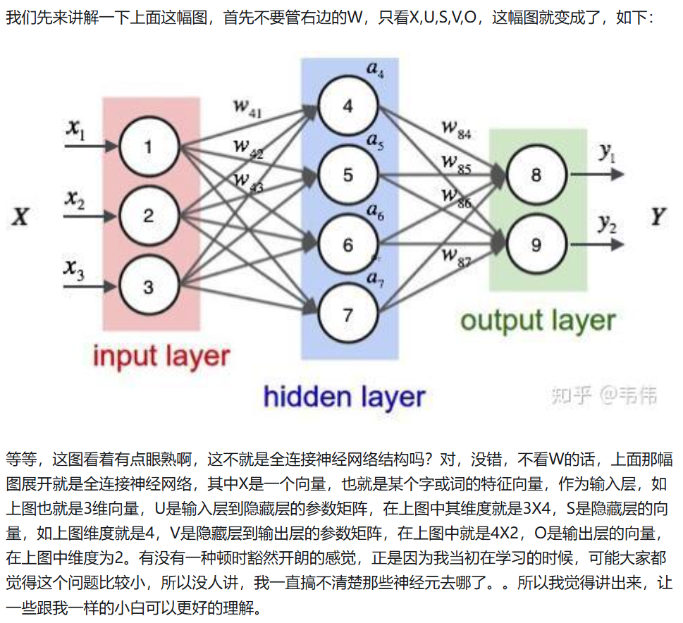
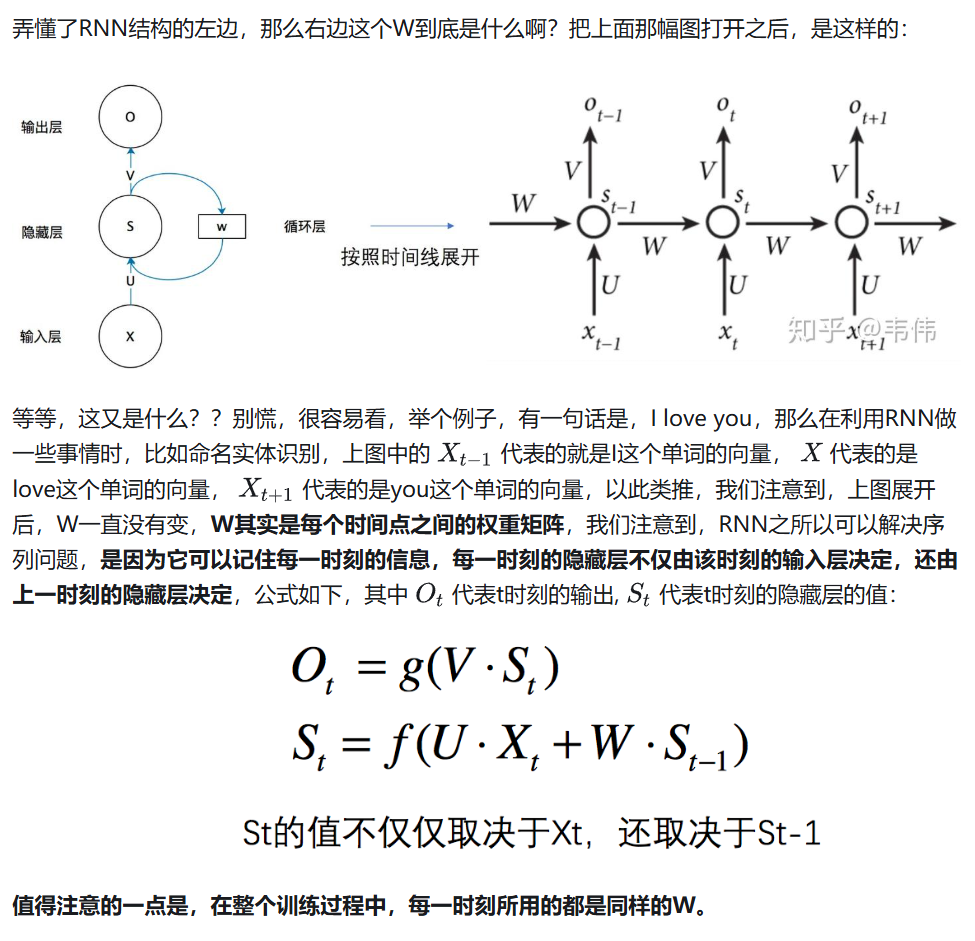

#  RNN笔记（DeepSeek生成）

学习资料：[史上最详细循环神经网络讲解（RNN/LSTM/GRU） - 知乎](https://zhuanlan.zhihu.com/p/123211148)

[如何从RNN起步，一步一步通俗理解LSTM_rnn lstm-CSDN博客](https://blog.csdn.net/v_JULY_v/article/details/89894058?ops_request_misc=%7B%22request%5Fid%22%3A%22372958dc3e235ea6aee3d35da39b2583%22%2C%22scm%22%3A%2220140713.130102334..%22%7D&request_id=372958dc3e235ea6aee3d35da39b2583&biz_id=0&utm_medium=distribute.pc_search_result.none-task-blog-2~all~top_positive~default-1-89894058-null-null.142^v102^pc_search_result_base3&utm_term=rnn&spm=1018.2226.3001.4187)

------

## 一、RNN的核心结构

### 1. 循环的本质
RNN的"循环"体现在**隐藏状态(Hidden State)的传递**上。每个时间步的隐藏状态不仅取决于当前输入，还依赖前一时间步的隐藏状态，形成链式结构。

### 2. RNN的数学模型
- **输入**：时间步$t$的输入为向量$\mathbf{x}_t \in \mathbb{R}^{D_x}$（如一个词的嵌入向量）。
- **隐藏状态**：$\mathbf{h}_t \in \mathbb{R}^{D_h}$，存储当前时间步的"记忆"。
- **输出**：$\mathbf{y}_t \in \mathbb{R}^{D_y}$，根据任务需求生成（如预测下一个词的概率）。

**计算步骤**（每个时间步$t$均执行以下操作）：
$$
\mathbf{h}_t = \tanh\left( \mathbf{W}_x \mathbf{x}_t + \mathbf{W}_h \mathbf{h}_{t-1} + \mathbf{b}_h \right)
$$
$$
\mathbf{y}_t = \text{softmax}\left( \mathbf{W}_y \mathbf{h}_t + \mathbf{b}_y \right)
$$

### 3. 权重矩阵的详细解释
- **输入权重**$\mathbf{W}_x \in \mathbb{R}^{D_h \times D_x}$：将输入$\mathbf{x}_t$映射到隐藏空间。
- **隐藏权重**$\mathbf{W}_h \in \mathbb{R}^{D_h \times D_h}$：将前一步的隐藏状态$\mathbf{h}_{t-1}$映射到当前隐藏空间。
- **输出权重**$\mathbf{W}_y \in \mathbb{R}^{D_y \times D_h}$：将隐藏状态$\mathbf{h}_t$映射到输出空间。
- **偏置项**$\mathbf{b}_h \in \mathbb{R}^{D_h}$、$\mathbf{b}_y \in \mathbb{R}^{D_y}$。

---

## 二、具体例子：字符级RNN生成文本

### 任务设定
- **目标**：输入一个字符序列（如`h, e, l, l`），预测下一个字符（期望输出`o`）。
- **输入与输出**：
  - 输入序列：`h → e → l → l`
  - 目标输出序列：`e → l → l → o`

### 1. 数据预处理
- **字符编码**：假设字符集为`{h, e, l, o}`，使用**one-hot编码**：

```
h → [1, 0, 0, 0]
e → [0, 1, 0, 0]
l → [0, 0, 1, 0]
o → [0, 0, 0, 1]
```

### 2. 模型参数初始化
- **输入维度**$D_x = 4$（字符集大小）
- **隐藏层维度**$D_h = 3$（自定义）
- **输出维度**$D_y = 4$（预测下一个字符的概率）
- **权重矩阵**（假设初始化为随机值）：
- $\mathbf{W}_x = \begin{bmatrix} 0.1 & -0.2 & 0.3 & 0.4 \\ -0.5 & 0.6 & 0.7 & -0.8 \\ 0.9 & -1.0 & 0.2 & 0.3 \end{bmatrix}$
- $\mathbf{W}_h = \begin{bmatrix} 0.5 & -0.1 & 0.2 \\ 0.3 & 0.4 & -0.6 \\ -0.2 & 0.7 & 0.1 \end{bmatrix}$
- $\mathbf{W}_y = \begin{bmatrix} 0.2 & -0.3 & 0.1 \\ -0.4 & 0.5 & 0.2 \\ 0.3 & 0.1 & -0.5 \\ 0.6 & -0.2 & 0.4 \end{bmatrix}$
- **偏置项**：
- $\mathbf{b}_h = [0.1, -0.2, 0.3]$
- $\mathbf{b}_y = [0.1, 0.2, -0.3, 0.4]$

### 3. 前向传播逐步计算
假设初始隐藏状态$\mathbf{h}_0 = [0, 0, 0]$。

**时间步$t=1$（输入`h`）**：

- 输入向量$\mathbf{x}_1 = \begin{bmatrix} 1 \\ 0 \\ 0 \\ 0 \end{bmatrix}$
- 计算隐藏状态：
$$
\mathbf{h}_1 = \tanh\left( 
\mathbf{W}_x \mathbf{x}_1 + \mathbf{W}_h \mathbf{h}_0 + \mathbf{b}_h 
\right)
$$
代入数值：
$$
\mathbf{W}_x \mathbf{x}_1 = \begin{bmatrix} 0.1 \\ -0.5 \\ 0.9 \end{bmatrix}, \quad
\mathbf{W}_h \mathbf{h}_0 = \begin{bmatrix} 0 \\ 0 \\ 0 \end{bmatrix}, \quad
\mathbf{b}_h = \begin{bmatrix} 0.1 \\ -0.2 \\ 0.3 \end{bmatrix}
$$
$$
\mathbf{h}_1 = \tanh\left( \begin{bmatrix} 0.1+0+0.1 \\ -0.5+0-0.2 \\ 0.9+0+0.3 \end{bmatrix} \right) = \tanh\left( \begin{bmatrix} 0.2 \\ -0.7 \\ 1.2 \end{bmatrix} \right) \approx \begin{bmatrix} 0.197 \\ -0.604 \\ 0.833 \end{bmatrix}
$$
- 计算输出：
$$
\mathbf{y}_1 = \text{softmax}\left( \mathbf{W}_y \mathbf{h}_1 + \mathbf{b}_y \right)
$$
代入数值：
$$
\mathbf{W}_y \mathbf{h}_1 = \begin{bmatrix} 0.2 \times 0.197 + (-0.3) \times (-0.604) + 0.1 \times 0.833 \\ \text{...（其他行类似）} \end{bmatrix}, \quad
\mathbf{b}_y = \begin{bmatrix} 0.1 \\ 0.2 \\ -0.3 \\ 0.4 \end{bmatrix}
$$
最终$\mathbf{y}_1$为输出概率，假设为`[0.1, 0.6, 0.2, 0.1]`，即预测下一个字符为`e`（正确）。

**时间步$t=2$（输入`e`）**：

- 输入向量$\mathbf{x}_2 = \begin{bmatrix} 0 \\ 1 \\ 0 \\ 0 \end{bmatrix}$
- 计算隐藏状态：
$$
\mathbf{h}_2 = \tanh\left( \mathbf{W}_x \mathbf{x}_2 + \mathbf{W}_h \mathbf{h}_1 + \mathbf{b}_h \right)
$$
代入数值：
$$
\mathbf{W}_x \mathbf{x}_2 = \begin{bmatrix} -0.2 \\ 0.6 \\ -1.0 \end{bmatrix}, \quad
\mathbf{W}_h \mathbf{h}_1 \approx \begin{bmatrix} 0.5 \times 0.197 + (-0.1) \times (-0.604) + 0.2 \times 0.833 \\ \text{...} \end{bmatrix}
$$
最终$\mathbf{h}_2$被更新，并用于计算输出$\mathbf{y}_2$。

### 4. 权重共享的直观理解
- **参数复用**：无论序列多长，所有时间步共享相同的$\mathbf{W}_x, \mathbf{W}_h, \mathbf{W}_y$。例如，处理第1步的`h`和第2步的`e`时，使用的$\mathbf{W}_x$完全相同。
- **循环的物理意义**：隐藏状态$\mathbf{h}_t$是序列历史的压缩表示。例如，在时间步$t=4$，$\mathbf{h}_4$包含了`h, e, l, l`的信息。

---

## 三、RNN的结构示意图

```
时间步展开示意图：
t=1       t=2       t=3       t=4
[x1] --> [x2] --> [x3] --> [x4]
 |        |        |        |
[h0] --> [h1] --> [h2] --> [h3] --> [h4]
 |        |        |        |        |
[y1]     [y2]     [y3]     [y4]
```

- **箭头方向**：信息从左到右流动，隐藏状态$\mathbf{h}_t$是连接不同时间步的桥梁。

---

## 四、RNN的关键特性

### 1. 参数共享
- 所有时间步使用相同的$\mathbf{W}_x, \mathbf{W}_h, \mathbf{W}_y$，使模型能处理任意长度的序列。
- **优势**：减少参数量，避免对序列长度的依赖。

### 2. 循环的数学本质
- 隐藏状态$\mathbf{h}_t$是当前输入和历史的函数：
$$
\mathbf{h}_t = f(\mathbf{x}_t, \mathbf{h}_{t-1})
$$
- **关键限制**：长序列中，早期信息可能因多次非线性变换（如`tanh`）逐渐消失（梯度消失问题）。

---

## 五、总结
- **核心结构**：通过隐藏状态传递历史信息，共享权重处理变长序列。
- **计算步骤**：每个时间步的隐藏状态和输出由当前输入、前一步隐藏状态及权重矩阵共同决定。
- **例子中的关键点**：权重矩阵的维度、隐藏状态的传递、参数共享的具体实现。

通过这个例子，你可以手动模拟RNN的前向传播过程，直观理解其如何通过循环结构和权重共享建模序列依赖。

------

## 六、附加知识





------

## 七、疑问解释

**隐藏状态 $\mathbf{h}_t$ 的本质和作用**是理解RNN的核心。

---

### **1. 隐藏状态 $\mathbf{h}_t$ 的本质**
- **不是单纯的中间变量**，而是RNN的"记忆单元"，存储了从序列开始到当前时间步 $t$ 的所有历史信息。
- **物理意义**：可以理解为模型对"看到过的序列部分的总结"。比如在处理文本时，$\mathbf{h}_t$ 编码了前 $t$ 个字符的上下文信息。

---

### **2. $\mathbf{h}_t$ 与输出 $\mathbf{y}_t$ 的关系**
- $\mathbf{y}_t$ 是任务相关的预测结果（如下一个字符的概率），**仅依赖当前步的 $\mathbf{h}_t$**：
  $$
  \mathbf{y}_t = \text{softmax}\left( \mathbf{W}_y \mathbf{h}_t + \mathbf{b}_y \right)
  $$
- **关键点**：虽然 $\mathbf{y}_t$ 只显式用到 $\mathbf{h}_t$，但 $\mathbf{h}_t$ 本身已隐含了所有历史信息。  
  （例如 $\mathbf{y}_4$ 预测 `o` 时，$\mathbf{h}_4$ 已经编码了 `h → e → l → l` 的完整序列）

---

### **3. 输出 $\mathbf{y}_t$ 可以不用吗？**
- **取决于任务类型**：
  - **序列生成任务**（如文本生成）：需要每一步输出 $\mathbf{y}_t$。
  - **序列编码任务**（如文本分类）：可能只需要最后一步的 $\mathbf{h}_T$ 作为整个序列的表示。
- 在之前的例子中，$\mathbf{y}_t$ 是必须的，因为任务要求预测每个时间步的下一个字符。

---

### **总结：$\mathbf{h}_t$ 的核心作用**
1. **信息传递**：是连接不同时间步的桥梁，使序列依赖建模成为可能。
2. **上下文编码**：将变长的历史序列压缩为固定维度的向量表示。
3. **任务适配**：既可用于生成每一步的输出（$\mathbf{y}_t$），也可作为整个序列的摘要（如最后一步的 $\mathbf{h}_T$）。

通过这种设计，RNN能够处理任意长度的序列，并捕捉时间维度上的复杂模式。

------

## 八、衡量语言模型--困惑度

困惑度（Perplexity）是评估语言模型质量的核心指标，用于衡量模型预测下一个词的能力。以下是其详细解释：

### 核心概念
1. **直观理解**  
   困惑度反映模型对下一个词的预测确定性。例如，对于句子“It is raining…”的续写：
   
   - **高质量模型** 生成合理且连贯的续写（如“outside”），其困惑度低。
   - **低质量模型** 可能生成无意义文本（如“piouw;kcj”），困惑度高。
   
2. **数学定义**  
   
   - **交叉熵损失**：模型对序列中每个词的条件概率取对数并求平均：
     $$
     \text{交叉熵损失} = \frac{1}{n} \sum_{t=1}^n -\log P(x_t \mid x_{t-1}, \ldots, x_1)
     $$
   - **困惑度**：交叉熵损失的指数形式：
     $$
     \text{Perplexity} = \exp\left(\frac{1}{n} \sum_{t=1}^n -\log P(x_t \mid x_{t-1}, \ldots, x_1)\right)
     $$
   
3. **关键性质**  
   
   - **最优情况**：若模型总能正确预测（概率为1），困惑度为1。
   - **最差情况**：若模型预测正确词概率为0，困惑度为无穷大。
   - **基线情况**：若模型预测为均匀分布，困惑度等于词表大小（如词表含1万词，困惑度为10000）。

### 解释与示例

1. **提供“有效选项数量”的直观解释**:
   - 这是困惑度最核心的解释。一个语言模型的困惑度可以被理解为：模型在预测下一个词时，平均下来，它认为有多少个词是等可能（equally probable）的选项。
   - 例子:
     - 假设一个模型对于下一个词完全不确定，并且词汇表大小为 V。如果它给每个词分配了 `1/V` 的概率，那么它的交叉熵是 `-log(1/V) = log(V)`，困惑度就是 `exp(log(V)) = V`。这意味着模型像是在 V 个选项中随机猜测。
     - 如果一个模型的困惑度是 100，这意味着它的预测能力（平均而言）相当于在每一步都面临 100 个等可能的词作为下一个词的选择。
     - 一个完美的模型，总能以概率 1 预测出正确的下一个词，其交叉熵为 0，困惑度为 `exp(0) = 1`。这意味着它在每一步都只有一个确定的选择。
   - **因此，困惑度越低，表示模型对下一个词的预测越确定，有效选项数量越少，模型性能越好。**

2. **调和平均数视角**：困惑度可理解为“下一个词的实际选择数的调和平均数”。例如，若困惑度为50，表示模型预测时平均面临50个等概率选择。

3. **计算示例**：

- 序列：["a", "b"]，模型预测概率为0.5和0.25。
- 交叉熵损失：$( \frac{\ln2 + \ln4}{2} \approx 1.0397 )$
- 困惑度：$( \exp(1.0397) \approx 2.83 )$，优于均匀分布（困惑度=4）。

### 应用与意义
- **模型比较**：通过困惑度可直接比较不同模型，无需考虑序列长度。
- **压缩效率**：困惑度越低，模型压缩文本所需比特数越少，反映更强的预测能力。

### 总结
困惑度将模型预测的不确定性转化为直观数值，值越低表示模型越精准。它是评估语言模型的核心工具，广泛应用于自然语言处理任务中。

------

如果对交叉熵损失和困惑都相关概念不理解，可以观看交叉熵损失笔记。

[交叉熵损失](../交叉熵损失(语言模型).md)
