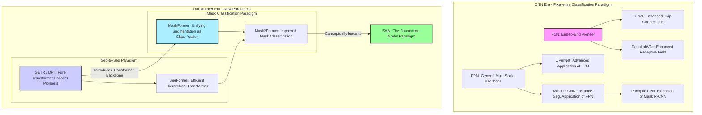

[图像分割模型对比表格](图像分割模型对比表格.xlsx)

------
### **模型关系族谱**

为了更直观地理解这些模型之间的关系，我们可以将它们归入几个主要的“技术流派”或“范式”：

### **图例中文解释**

上面这张图展示了图像分割模型的演进关系，分为两个主要时代和多个范式：

1.  **CNN时代 - 像素分类范式 (CNN Era - Pixel-wise Classification Paradigm)**
    *   这个时代的核心思想是将分割视为对每个像素进行分类。
    *   **FCN (开创者)**: 是一切的起点。
    *   它直接发展出了 **U-Net** (通过强化跳跃连接) 和 **DeepLabV3+** (通过强化感受野)。
    *   **FPN (通用的多尺度骨干网络)** 是一个关键组件，它被 **UPerNet**、**Mask R-CNN** 和 **Panoptic FPN** 等模型广泛应用，以融合多尺度特征。

2.  **Transformer时代 - 新范式探索 (Transformer Era - New Paradigms)**
    *   这个时代引入了注意力机制，并带来了范式级的革新。
    *   **序列到序列范式 (Seq-to-Seq Paradigm)**:
        *   **SETR / DPT (先驱)**: 开启了使用纯Transformer作为编码器，将图像看作序列进行处理的道路。
        *   **SegFormer**: 是对上述路线的效率优化，设计了层级化的Transformer，使其更轻量、更高效。
    *   **掩码分类范式 (Mask Classification Paradigm)**:
        *   **MaskFormer (开创者)**: 颠覆性地将分割问题从“给像素分类”重定义为“预测一组(掩码, 类别)对”，统一了语义和实例分割的终极目标。
        *   **Mask2Former**: 是MaskFormer的直接改进版，通过引入掩码注意力机制，获得了更高的精度和更快的收敛速度。
    *   **基础模型范式 (The Foundation Model Paradigm)**:
        *   **SAM**: 代表了分割领域当前最前沿的、通用的、可提示的分割能力。它继承了Transformer架构的强大能力，并通过海量数据训练，将分割任务推向了“零样本”泛化的新高度。

**标注颜色说明:**

*   **粉色 (FCN)**: 代表CNN语义分割的开创者。
*   **蓝色 (SETR / DPT)**: 代表将纯Transformer引入分割领域的先驱。
*   **青色 (MaskFormer)**: 代表“掩码分类”新范式的开创者。
*   **绿色 (SAM)**: 代表“基础模型”新范式的最终体现。

### **模型关系深度梳理**

- **FCN (Fully Convolutional Networks)**
  - **定位**: **语义分割的鼻祖**。
  - **描述**: 开创性地提出了端到端的全卷积网络，将分类网络末尾的全连接层替换为卷积层，实现了对任意尺寸图像的像素级密集预测。它奠定了后续所有语义分割模型的基础。

- **U-Net**
  - **与FCN的关系**: **FCN跳跃连接思想的极致发扬**。FCN的跳跃连接较为简单，而U-Net设计了优雅的U形对称结构。通过大量的长跳跃连接，它将编码器中高分辨率的浅层特征与解码器对应层进行拼接（Concatenate），极大地弥补了下采样过程中损失的空间细节，特别适用于需要精确边界的场景。

- **DeepLabV3+**
  - **与FCN的关系**: **FCN感受野问题的解决方案**。DeepLab系列继承了FCN的纯卷积思想，其核心创新——**空洞卷积（Atrous Convolution）**，旨在解决FCN因连续池化导致分辨率骤降和感受野受限的问题。它允许模型在不牺牲分辨率的情况下指数级扩大感受野，并通过ASPP模块捕捉丰富的多尺度上下文。

- **Mask R-CNN**
  - **定位**: **实例分割的里程碑**。
  - **描述**: 它是目标检测器Faster R-CNN的扩展，构建于**FPN**提取的多尺度特征之上，并增加了一个并行的掩码预测分支。该分支本质上就是在每个提议区域（RoI）上运行的**一个微型FCN**，用于生成像素级的实例掩码，从而将目标检测扩展到了实例分割。

- **Panoptic FPN**
  - **与Mask R-CNN的关系**: **Mask R-CNN的全景分割扩展**。它在Mask R-CNN（用于分割前景实例"Things"）的基础上，并行增加了一个轻量级的语义分割分支（通常是基于FPN特征的简单FCN结构），专门用于分割背景"Stuff"，最终将两部分结果融合，实现全景分割。

- **UPerNet (Unified Perceptual Parsing Network)**
  - **与FPN的关系**: **FPN思想的集大成者**。UPerNet将FPN作为其基础架构，并在FPN输出的特征金字塔之上，进一步加入了**金字塔池化模块 (Pyramid Pooling Module, PPM)**。这相当于在FPN的多尺度特征之上，再次进行了一次全局上下文信息的聚合。这种“FPN + PPM”的双重多尺度融合策略，使其成为一个非常强大和通用的分割基线模型。

- **SETR (SEgmentation TRansformer)**
  - **定位**: **开启纯Transformer分割的先驱**。
  - **与CNN模型的关系**: **范式级的变革**。SETR是首批将标准的、非层级化的Vision Transformer (ViT) 直接用作编码器的工作之一。它完全抛弃了CNN的卷积和池化，将图像分割重新定义为一个**序列到序列（Sequence-to-Sequence）**的任务，为后续的Transformer分割模型指明了方向。

- **DPT (Dense Prediction Transformer)**
  - **与SETR的关系**: **思想一致的同路人**。与SETR几乎同时提出，DPT同样采用ViT作为骨干网络，探索了如何将Transformer的输出序列重新组合成用于密集预测（如分割、深度估计）的图像特征图。它和SETR共同验证了Transformer作为强大分割编码器的可行性。

- **SegFormer**
  - **与SETR/DPT的关系**: **SETR/DPT的效率进化版**。SETR等早期模型计算量巨大且输出特征图单一。SegFormer解决了这些痛点：1) 设计了**层级化的Transformer编码器**，可以像CNN一样输出多尺度的特征图；2) 抛弃了复杂的解码器，仅使用一个轻量的**MLP解码器**。这使得它在保持高性能的同时，模型更小、效率更高。

- **MaskFormer**
  - **定位**: **“掩码分类”新范式的开创者**。
  - **与之前模型的关系**: **对分割任务的重新定义**。无论是CNN还是SegFormer，本质都是在做像素分类。MaskFormer颠覆了这一点，它将分割任务统一建模为**掩码分类**问题。它不再为每个像素预测类别，而是输出N个`(类别, 掩码)`对。这种思想借鉴自目标检测领域的DETR，极大地简化了分割流程，并首次用一个统一框架优雅地解决了语义、实例和全景分割。

- **Mask2Former**
  - **与MaskFormer的关系**: **MaskFormer的全面升级版**。Mask2Former继承了MaskFormer的“掩码分类”思想，并对其核心的Transformer解码器进行了关键改进：引入了**掩码注意力（Masked Attention）**机制。这使得查询（Query）只关注其预测掩码内的特征，从而提高了训练效率和最终精度，成为当时全景分割等任务的SOTA（State-of-the-Art）模型。

- **SAM (Segment Anything Model)**
  - **与以上所有模型的关系**: **分割领域的“基础模型”新范式**。
    - **技术继承**: 它的核心是一个强大的Transformer图像编码器，可以说是**SETR、SegFormer**等Transformer路线的终极体现。其掩码解码器也或多或少借鉴了**MaskFormer**系列中“查询-掩码”的思想。
    - **思想颠覆**: 它与传统模型的关系是“降维打击”。传统模型学习“如何分割猫”，而SAM通过海量数据学习“什么是可分割的单元”，然后根据用户的实时提示（点、框等）来分割万物。它将专有任务模型推向了通用基础模型，其零样本泛化能力是此前所有模型都无法比拟的。